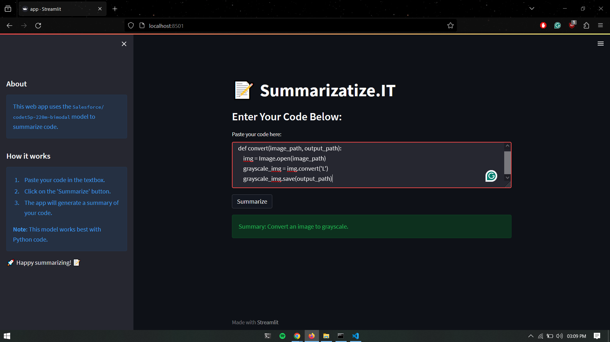

# 📝 Summarizatize.IT

This is a Streamlit web application for summarizing code using the Hugging Face Transformers library with the `Salesforce/codet5p-220m-bimodal` model.

## Demo



_Description: This screenshot shows the app in action, summarizing a code snippet._

## Features

- **Code Summarization**: Paste your code in the provided textbox and click "Summarize" to get a summary.
- **Easy to Use**: Simple interface for quickly summarizing code snippets.
- **Built with Streamlit**: Leveraging Streamlit for easy web app development.

## How to Use

1. Clone the repository:

```bash
git clone https://github.com/ManasVardhan/CodeSummarization.git
```

2. Install the required libraries:

```bash
pip install -r requirements.txt
```

3. Run the Streamlit app:

```bash
streamlit run app.py
```

4. Open your web browser and go to http://localhost:8501 to use the app locally.

## Dependencies

- Python 3.8
- Streamlit
- Hugging Face Transformers

## Contributing

Contributions are welcome! Feel free to open an issue or submit a pull request.

## License

This project is licensed under the MIT License - see the LICENSE file for details.
